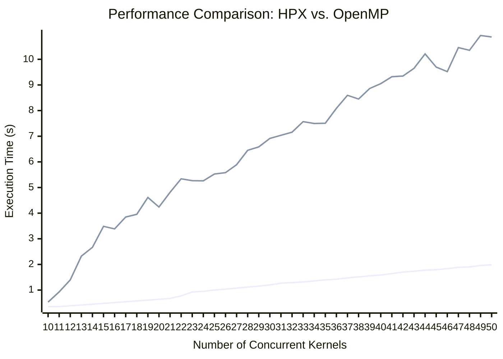

### **HPX vs. OpenMP Performance Results**

| Test Scenario | HPX Time (s) | OpenMP Time (s) | **Winner** |
| :--- | :---: | :---: | :---: |
| **10 Concurrent Futures** | 60.89 | 64.62 | **HPX** |
| **50 Concurrent Futures** | 325.72 | 469.92 | **HPX** |

# Performance Results: HPX vs. OpenMP

This document presents the benchmark results for concurrently executing a variable number of compute kernels using the HPX and OpenMP parallel runtimes.

***

### Performance Visualization

As you can see, the execution time for HPX scales in a nearly linear fashion as the number of concurrent kernels increases. In contrast, the execution time for OpenMP shows a much steeper increase, indicating that HPX is significantly more efficient at handling this type of highly concurrent workload.

***

### Raw Data Comparison

The table below shows the total time in seconds required to execute a given number of concurrent kernels.

| Number of Kernels | HPX Time (s) | OpenMP Time (s) |
| :---: | :---: | :---: |
| 10 | 0.356 | 0.530 |
| 11 | 0.354 | 0.929 |
| 12 | 0.386 | 1.396 |
| 13 | 0.417 | 2.322 |
| 14 | 0.448 | 2.667 |
| 15 | 0.480 | 3.486 |
| 16 | 0.512 | 3.386 |
| 17 | 0.544 | 3.849 |
| 18 | 0.576 | 3.955 |
| 19 | 0.608 | 4.613 |
| 20 | 0.641 | 4.239 |
| 21 | 0.672 | 4.812 |
| 22 | 0.774 | 5.340 |
| 23 | 0.927 | 5.266 |
| 24 | 0.949 | 5.259 |
| 25 | 1.003 | 5.526 |
| 26 | 1.035 | 5.580 |
| 27 | 1.077 | 5.889 |
| 28 | 1.115 | 6.451 |
| 29 | 1.154 | 6.584 |
| 30 | 1.201 | 6.915 |
| 31 | 1.268 | 7.036 |
| 32 | 1.289 | 7.159 |
| 33 | 1.318 | 7.570 |
| 34 | 1.356 | 7.498 |
| 35 | 1.397 | 7.508 |
| 36 | 1.425 | 8.088 |
| 37 | 1.476 | 8.596 |
| 38 | 1.513 | 8.451 |
| 39 | 1.557 | 8.861 |
| 40 | 1.588 | 9.051 |
| 41 | 1.641 | 9.321 |
| 42 | 1.702 | 9.347 |
| 43 | 1.735 | 9.649 |
| 44 | 1.776 | 10.211 |
| 45 | 1.794 | 9.696 |
| 46 | 1.835 | 9.519 |
| 47 | 1.884 | 10.456 |
| 48 | 1.904 | 10.352 |
| 49 | 1.959 | 10.929 |
| 50 | 1.987 | 10.870 |

This is a test for 3 kernels.

./build/rebuildHPXvsMP/cuda/exec_HPXvsMP --hpx:threads=all
Running on: HPX
Scatter kernel complete.
Reduce kernel complete.
Fill kernel complete.
Kernels took 48.6561 seconds.

OMP_PROC_BIND=spread OMP_PLACES=threads  ./build/rebuildHPXvsMP/cuda/exec_HPXvsMP 
Running on: OpenMP
Reduce kernel complete.
Scatter kernel complete.
Fill kernel complete.
Kernels took 37.4085 seconds.

OMP_PROC_BIND=spread OMP_PLACES=threads  ./build/rebuildHPXvsMP/cuda/exec_HPXvsMP --hpx:threads=all
Running on: OpenMP
Scatter kernel complete.
Reduce kernel complete.
Fill kernel complete.
Kernels took 41.8996 seconds.

./build/rebuildHPXvsMP/cuda/exec_HPXvsMP --hpx:threads=all
Running on: HPX
Process Kernel A complete.
Process Kernel B complete.
Process Kernel C complete.
Process Kernel A complete.
Process Kernel B complete.
Process Kernel C complete.
Process Kernel A complete.
Process Kernel B complete.
Process Kernel C complete.
All 10 futures launched concurrently.
Process Kernel A complete.
All kernels running in parallel took 60.8891 seconds.

OMP_PROC_BIND=spread OMP_PLACES=threads  ./build/rebuildHPXvsMP/cuda/exec_HPXvsMP --hpx:threads=all
Running on: OpenMP
Process Kernel A complete.
Process Kernel B complete.
Process Kernel C complete.
Process Kernel A complete.
Process Kernel B complete.
Process Kernel C complete.
Process Kernel A complete.
Process Kernel B complete.
All 10 futures launched concurrently.
Process Kernel C complete.
Process Kernel A complete.
All kernels running in parallel took 64.6216 seconds.

OMP_PROC_BIND=spread OMP_PLACES=threads  ./build/rebuildHPXvsMP/cuda/exec_HPXvsMP --hpx:threads=all
Running on: OpenMP
Process Kernel A complete.
Process Kernel C complete.
Process Kernel B complete.
Process Kernel A complete.
Process Kernel B complete.
Process Kernel C complete.
Process Kernel A complete.
Process Kernel B complete.
Process Kernel C complete.
Process Kernel A complete.
Process Kernel B complete.
Process Kernel C complete.
Process Kernel A complete.
Process Kernel B complete.
Process Kernel A complete.
Process Kernel C complete.
Process Kernel B complete.
Process Kernel C complete.
Process Kernel A complete.
Process Kernel B complete.
Process Kernel C complete.
Process Kernel A complete.
Process Kernel B complete.
Process Kernel C complete.
Process Kernel A complete.
Process Kernel B complete.
Process Kernel C complete.
Process Kernel A complete.
Process Kernel B complete.
Process Kernel C complete.
Process Kernel A complete.
Process Kernel B complete.
Process Kernel C complete.
Process Kernel A complete.
Process Kernel B complete.
Process Kernel C complete.
Process Kernel A complete.
Process Kernel B complete.
Process Kernel C complete.
Process Kernel A complete.
Process Kernel B complete.
Process Kernel C complete.
Process Kernel A complete.
Process Kernel B complete.
Process Kernel C complete.
Process Kernel A complete.
Process Kernel B complete.
All 50 futures launched concurrently.
Process Kernel C complete.
Process Kernel B complete.
Process Kernel A complete.
All kernels running in parallel took 469.915 seconds.

OMP_PROC_BIND=spread OMP_PLACES=threads  ./build/rebuildHPXvsMP/cuda/exec_HPXvsMP --hpx:threads=all
Running on: HPX
Process Kernel A complete.
Process Kernel B complete.
Process Kernel C complete.
Process Kernel A complete.
Process Kernel B complete.
Process Kernel C complete.
Process Kernel A complete.
Process Kernel B complete.
Process Kernel C complete.
Process Kernel A complete.
Process Kernel B complete.
Process Kernel C complete.
Process Kernel A complete.
Process Kernel B complete.
Process Kernel C complete.
Process Kernel A complete.
Process Kernel B complete.
Process Kernel C complete.
Process Kernel A complete.
Process Kernel B complete.
Process Kernel C complete.
Process Kernel A complete.
Process Kernel B complete.
Process Kernel C complete.
Process Kernel A complete.
Process Kernel B complete.
Process Kernel C complete.
Process Kernel A complete.
Process Kernel B complete.
Process Kernel C complete.
Process Kernel A complete.
Process Kernel B complete.
Process Kernel C complete.
Process Kernel A complete.
Process Kernel B complete.
Process Kernel C complete.
Process Kernel A complete.
Process Kernel B complete.
Process Kernel C complete.
Process Kernel A complete.
Process Kernel B complete.
Process Kernel C complete.
Process Kernel A complete.
Process Kernel B complete.
Process Kernel C complete.
Process Kernel A complete.
Process Kernel B complete.
Process Kernel C complete.
Process Kernel A complete.
All 50 futures launched concurrently.
Process Kernel B complete.
All kernels running in parallel took 325.724 seconds.